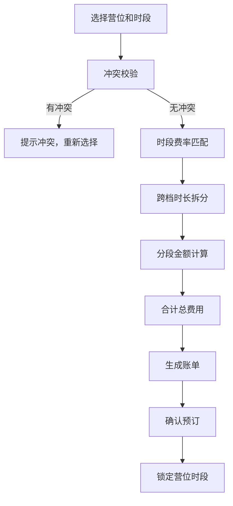

## 1. 产品概述

房车营地租位管理系统，用于管理房车营地的车位预订、冲突检测、时段计费和账单生成。解决房车营地运营中的重复预订、费率计算复杂、收费不透明等问题，提升营地管理效率和用户体验。

## 2. 核心功能

### 2.1 用户角色
| 角色 | 注册方式 | 核心权限 |
|------|----------|----------|
| 管理员 | 系统预置 | 营位管理、费率配置、预订管理、账单查看、数据统计 |
| 操作员 | 管理员创建 | 营位预订、退订处理、账单查询 |

### 2.2 功能模块
1. **营位排期模块**：房车位建档、营位日历视图、时段状态展示、水电桩接驳管理
2. **冲突校验模块**：时段重叠校验、预订冲突检测、退订时段释放、实时状态更新
3. **时段计费模块**：费率表维护、旺季/淡季/平季多档费率、跨档时长拆分、分段金额合计
4. **账单生成模块**：自动计算费用、账单明细展示、水电接驳费计算、账单导出

### 2.3 页面详情
| 页面名称 | 模块名称 | 功能描述 |
|---------|----------|----------|
| 首页仪表盘 | 数据概览 | 今日入住/退房、营收统计、营位使用率、快捷操作入口 |
| 营位管理 | 营位排期 | 房车位增删改查、营位列表展示、水电桩配置、状态管理 |
| 预订管理 | 营位排期/冲突校验 | 新建预订、日历排期视图、冲突实时检测、预订详情、退订操作 |
| 费率管理 | 时段计费 | 费率表维护、旺季/淡季/平季设置、特殊日期费率、水电费率配置 |
| 账单管理 | 账单生成 | 账单列表、账单详情、费用明细展示、账单状态管理 |

## 3. 核心流程

### 3.1 预订流程
用户选择营位和入住时段 → 系统校验时段冲突 → 无冲突则计算费用（跨档分段计费）→ 确认预订并锁定时段 → 生成账单

### 3.2 退订流程
用户申请退订 → 系统确认预订状态 → 释放时段资源 → 更新账单状态 → 营位状态恢复可用

### 3.3 计费流程
获取预订时段 → 匹配费率表 → 识别费率切换点 → 拆分跨费率时段 → 分段计算金额 → 合计总费用 + 水电接驳费

## 4. 用户界面设计

### 4.1 设计风格
- **主色调**：深绿色（#166534），代表自然、户外、营地
- **辅助色**：琥珀色（#d97706），用于强调和操作按钮
- **中性色**：深灰色系（zinc），用于文字和背景
- **按钮风格**：圆角矩形，悬停时有阴影和轻微上浮效果
- **字体**：标题使用 Lora 衬线字体，正文使用 Inter 无衬线字体
- **布局风格**：卡片式布局，顶部导航 + 侧边菜单 + 内容区三段式
- **图标风格**：lucide-react 线性图标，配合自然露营主题

### 4.2 页面设计概述
| 页面名称 | 模块名称 | UI 元素 |
|---------|----------|---------|
| 首页仪表盘 | 数据概览 | 统计卡片网格、今日预订时间线、营位状态环形图、快捷操作按钮 |
| 营位管理 | 营位列表 | 表格展示、营位状态标签、筛选工具栏、新增/编辑弹窗 |
| 预订管理 | 日历排期 | 周/月视图切换、时间轴热力图、拖拽预订、冲突高亮提示 |
| 费率管理 | 费率配置 | 时段费率表格、季节费率卡片、费率优先级设置 |
| 账单管理 | 账单列表 | 账单卡片、费用明细折叠面板、状态筛选、导出按钮 |

### 4.3 响应式设计
- 桌面端（≥1280px）：侧边栏 + 主内容区，完整功能展示
- 平板端（768px-1279px）：可折叠侧边栏，表格改为卡片列表
- 移动端（<768px）：底部导航栏，单列布局，核心功能优先展示

### 4.4 动效设计
- 页面加载：元素淡入 + 轻微上移动画， staggered 延迟效果
- 日历交互：时段选中时缩放高亮，冲突时红色抖动提示
- 按钮交互：悬停时背景色渐变 + 轻微上浮
- 模态框：背景模糊 + 缩放弹出动画
- 数据更新：数字滚动动画，状态切换过渡效果
