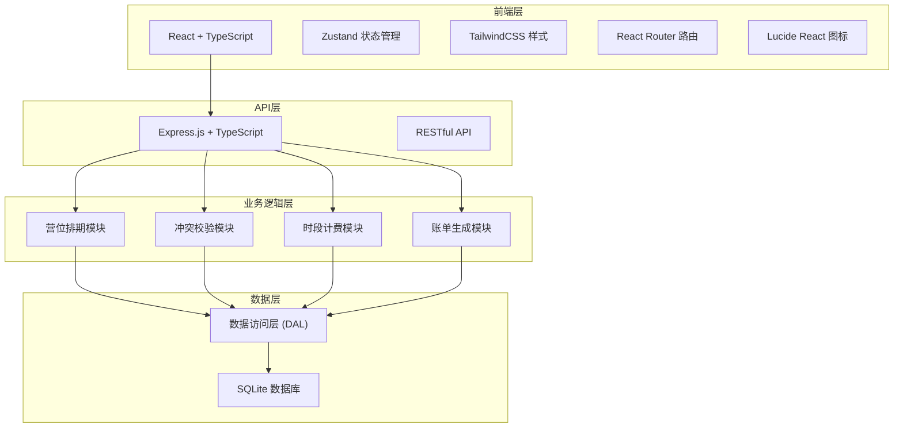
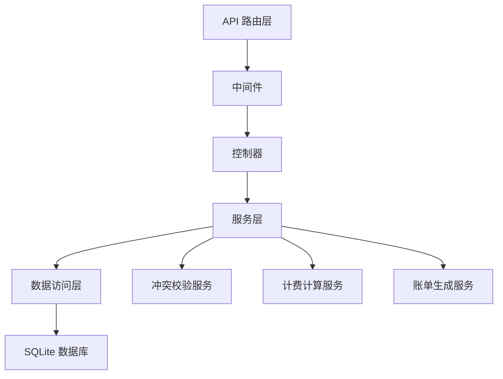
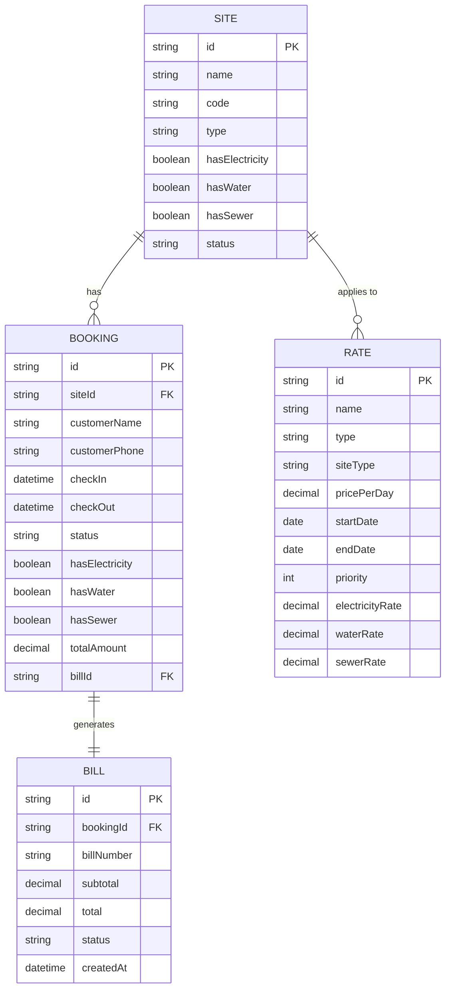

## 1. 架构设计



## 2. 技术描述

- **前端**: React@18 + TypeScript + TailwindCSS@3 + Vite + Zustand + React Router DOM + Lucide React
- **后端**: Express@4 + TypeScript
- **数据库**: SQLite (本地文件存储，便于演示和部署)
- **初始化工具**: vite-init
- **包管理器**: npm (Windows环境)

## 3. 路由定义

| 路由 | 页面 | 功能 |
|------|------|------|
| / | 仪表盘首页 | 数据概览、快捷操作 |
| /sites | 营位管理 | 营位CRUD、水电桩配置 |
| /bookings | 预订管理 | 日历排期、新建预订、退订操作 |
| /rates | 费率管理 | 费率配置、季节设置 |
| /bills | 账单管理 | 账单列表、详情查看 |

## 4. API 定义

### 4.1 营位相关
```typescript
// 营位类型
interface Site {
  id: string;
  name: string;
  code: string;
  type: 'standard' | 'premium' | 'vip';
  hasElectricity: boolean;
  hasWater: boolean;
  hasSewer: boolean;
  status: 'available' | 'maintenance' | 'closed';
  description?: string;
  createdAt: string;
  updatedAt: string;
}

// GET /api/sites - 获取营位列表
// POST /api/sites - 创建营位
// PUT /api/sites/:id - 更新营位
// DELETE /api/sites/:id - 删除营位
```

### 4.2 预订相关
```typescript
// 预订类型
interface Booking {
  id: string;
  siteId: string;
  customerName: string;
  customerPhone: string;
  checkIn: string;
  checkOut: string;
  status: 'confirmed' | 'checked-in' | 'checked-out' | 'cancelled';
  hasElectricity: boolean;
  hasWater: boolean;
  hasSewer: boolean;
  totalAmount: number;
  billId?: string;
  createdAt: string;
  updatedAt: string;
}

// GET /api/bookings - 获取预订列表
// GET /api/bookings/conflict?siteId&checkIn&checkOut - 冲突检测
// POST /api/bookings - 创建预订
// PUT /api/bookings/:id - 更新预订
// POST /api/bookings/:id/cancel - 取消预订
```

### 4.3 费率相关
```typescript
// 费率类型
interface Rate {
  id: string;
  name: string;
  type: 'peak' | 'normal' | 'off-peak';
  siteType: 'standard' | 'premium' | 'vip';
  pricePerDay: number;
  startDate: string;
  endDate: string;
  priority: number;
  electricityRate: number;
  waterRate: number;
  sewerRate: number;
  createdAt: string;
  updatedAt: string;
}

// GET /api/rates - 获取费率列表
// POST /api/rates - 创建费率
// PUT /api/rates/:id - 更新费率
// DELETE /api/rates/:id - 删除费率
// POST /api/rates/calculate - 计算费用
```

### 4.4 账单相关
```typescript
// 账单类型
interface Bill {
  id: string;
  bookingId: string;
  billNumber: string;
  items: BillItem[];
  subtotal: number;
  total: number;
  status: 'pending' | 'paid' | 'refunded';
  createdAt: string;
  paidAt?: string;
}

interface BillItem {
  id: string;
  description: string;
  type: 'site_fee' | 'electricity' | 'water' | 'sewer';
  quantity: number;
  unitPrice: number;
  amount: number;
  period?: string;
}

// GET /api/bills - 获取账单列表
// GET /api/bills/:id - 获取账单详情
// PUT /api/bills/:id/pay - 标记已支付
```

## 5. 服务器架构



## 6. 数据模型

### 6.1 ER 图



### 6.2 DDL 语句

```sql
-- 营位表
CREATE TABLE sites (
  id TEXT PRIMARY KEY,
  name TEXT NOT NULL,
  code TEXT NOT NULL UNIQUE,
  type TEXT NOT NULL CHECK (type IN ('standard', 'premium', 'vip')),
  hasElectricity INTEGER NOT NULL DEFAULT 1,
  hasWater INTEGER NOT NULL DEFAULT 1,
  hasSewer INTEGER NOT NULL DEFAULT 1,
  status TEXT NOT NULL DEFAULT 'available' CHECK (status IN ('available', 'maintenance', 'closed')),
  description TEXT,
  createdAt TEXT NOT NULL,
  updatedAt TEXT NOT NULL
);

-- 预订表
CREATE TABLE bookings (
  id TEXT PRIMARY KEY,
  siteId TEXT NOT NULL,
  customerName TEXT NOT NULL,
  customerPhone TEXT NOT NULL,
  checkIn TEXT NOT NULL,
  checkOut TEXT NOT NULL,
  status TEXT NOT NULL DEFAULT 'confirmed' CHECK (status IN ('confirmed', 'checked-in', 'checked-out', 'cancelled')),
  hasElectricity INTEGER NOT NULL DEFAULT 1,
  hasWater INTEGER NOT NULL DEFAULT 1,
  hasSewer INTEGER NOT NULL DEFAULT 1,
  totalAmount REAL NOT NULL DEFAULT 0,
  billId TEXT,
  createdAt TEXT NOT NULL,
  updatedAt TEXT NOT NULL,
  FOREIGN KEY (siteId) REFERENCES sites (id)
);

CREATE INDEX idx_bookings_site ON bookings (siteId);
CREATE INDEX idx_bookings_dates ON bookings (checkIn, checkOut);

-- 费率表
CREATE TABLE rates (
  id TEXT PRIMARY KEY,
  name TEXT NOT NULL,
  type TEXT NOT NULL CHECK (type IN ('peak', 'normal', 'off-peak')),
  siteType TEXT NOT NULL CHECK (siteType IN ('standard', 'premium', 'vip')),
  pricePerDay REAL NOT NULL,
  startDate TEXT NOT NULL,
  endDate TEXT NOT NULL,
  priority INTEGER NOT NULL DEFAULT 0,
  electricityRate REAL NOT NULL DEFAULT 0,
  waterRate REAL NOT NULL DEFAULT 0,
  sewerRate REAL NOT NULL DEFAULT 0,
  createdAt TEXT NOT NULL,
  updatedAt TEXT NOT NULL
);

-- 账单表
CREATE TABLE bills (
  id TEXT PRIMARY KEY,
  bookingId TEXT NOT NULL,
  billNumber TEXT NOT NULL UNIQUE,
  subtotal REAL NOT NULL,
  total REAL NOT NULL,
  status TEXT NOT NULL DEFAULT 'pending' CHECK (status IN ('pending', 'paid', 'refunded')),
  createdAt TEXT NOT NULL,
  paidAt TEXT,
  FOREIGN KEY (bookingId) REFERENCES bookings (id)
);

-- 账单明细表
CREATE TABLE bill_items (
  id TEXT PRIMARY KEY,
  billId TEXT NOT NULL,
  description TEXT NOT NULL,
  type TEXT NOT NULL CHECK (type IN ('site_fee', 'electricity', 'water', 'sewer')),
  quantity REAL NOT NULL,
  unitPrice REAL NOT NULL,
  amount REAL NOT NULL,
  period TEXT,
  FOREIGN KEY (billId) REFERENCES bills (id)
);
```

### 6.3 初始化数据

```sql
-- 初始化营位数据
INSERT INTO sites (id, name, code, type, hasElectricity, hasWater, hasSewer, status, createdAt, updatedAt) VALUES
('s1', '标准营位 A1', 'A1', 'standard', 1, 1, 1, 'available', datetime('now'), datetime('now')),
('s2', '标准营位 A2', 'A2', 'standard', 1, 1, 1, 'available', datetime('now'), datetime('now')),
('s3', '标准营位 A3', 'A3', 'standard', 1, 1, 0, 'available', datetime('now'), datetime('now')),
('s4', '高级营位 B1', 'B1', 'premium', 1, 1, 1, 'available', datetime('now'), datetime('now')),
('s5', '高级营位 B2', 'B2', 'premium', 1, 1, 1, 'available', datetime('now'), datetime('now')),
('s6', 'VIP营位 C1', 'C1', 'vip', 1, 1, 1, 'available', datetime('now'), datetime('now'));

-- 初始化费率数据
INSERT INTO rates (id, name, type, siteType, pricePerDay, startDate, endDate, priority, electricityRate, waterRate, sewerRate, createdAt, updatedAt) VALUES
('r1', '旺季-标准', 'peak', 'standard', 180, '2026-07-01', '2026-08-31', 10, 20, 15, 10, datetime('now'), datetime('now')),
('r2', '平季-标准', 'normal', 'standard', 120, '2026-04-01', '2026-06-30', 5, 20, 15, 10, datetime('now'), datetime('now')),
('r3', '平季-标准', 'normal', 'standard', 120, '2026-09-01', '2026-10-31', 5, 20, 15, 10, datetime('now'), datetime('now')),
('r4', '淡季-标准', 'off-peak', 'standard', 80, '2026-01-01', '2026-03-31', 0, 20, 15, 10, datetime('now'), datetime('now')),
('r5', '淡季-标准', 'off-peak', 'standard', 80, '2026-11-01', '2026-12-31', 0, 20, 15, 10, datetime('now'), datetime('now')),
('r6', '旺季-高级', 'peak', 'premium', 280, '2026-07-01', '2026-08-31', 10, 20, 15, 10, datetime('now'), datetime('now')),
('r7', '平季-高级', 'normal', 'premium', 200, '2026-04-01', '2026-06-30', 5, 20, 15, 10, datetime('now'), datetime('now')),
('r8', '平季-高级', 'normal', 'premium', 200, '2026-09-01', '2026-10-31', 5, 20, 15, 10, datetime('now'), datetime('now')),
('r9', '淡季-高级', 'off-peak', 'premium', 140, '2026-01-01', '2026-03-31', 0, 20, 15, 10, datetime('now'), datetime('now')),
('r10', '淡季-高级', 'off-peak', 'premium', 140, '2026-11-01', '2026-12-31', 0, 20, 15, 10, datetime('now'), datetime('now')),
('r11', '旺季-VIP', 'peak', 'vip', 480, '2026-07-01', '2026-08-31', 10, 20, 15, 10, datetime('now'), datetime('now')),
('r12', '平季-VIP', 'normal', 'vip', 350, '2026-04-01', '2026-06-30', 5, 20, 15, 10, datetime('now'), datetime('now')),
('r13', '平季-VIP', 'normal', 'vip', 350, '2026-09-01', '2026-10-31', 5, 20, 15, 10, datetime('now'), datetime('now')),
('r14', '淡季-VIP', 'off-peak', 'vip', 250, '2026-01-01', '2026-03-31', 0, 20, 15, 10, datetime('now'), datetime('now')),
('r15', '淡季-VIP', 'off-peak', 'vip', 250, '2026-11-01', '2026-12-31', 0, 20, 15, 10, datetime('now'), datetime('now'));
```
